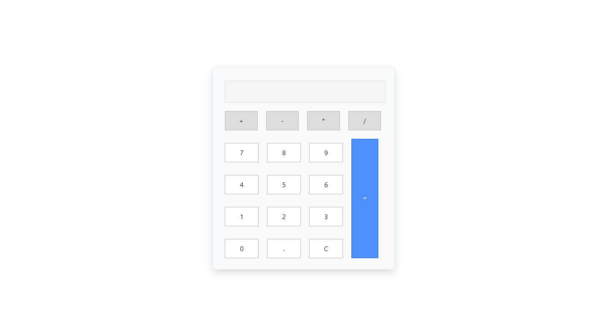

# Calculadora
 Calculadora, praticando ensinamentos de JavaScript.
 
 Nesse projeto eu quis me desafiar mais ainda, tentando o melhor que eu pude com o conhecimento que tenho até agora.

Link para o projeto <a href="https://calculate-project.netlify.app/">Calculadora</a> ✔️ RESPONSIVO

<h3>Nesse Projeto Utilizei as seguintes skills: <h3>

 HTML5 

 CSS3 

 BootStrap 

 JavaScript 

